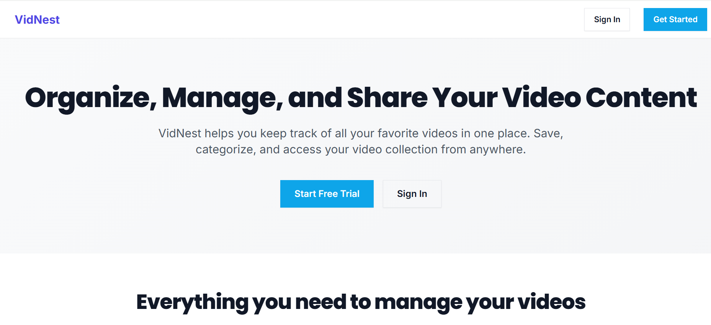

 # VidNest

 VidNest is a full-stack video bookmarking and organization platform that helps users save, categorize, search, and manage videos from across the web in one personal library.

 It was built to demonstrate production-minded full-stack engineering: responsive UX, secure authentication, API design, testing, CI/CD, Docker-based workflows, and Kubernetes-ready deployment manifests.

 

 ## Overview

 VidNest solves a simple but common problem: Social media users often save posts within a platform but might forget where they saved a certain post when they use multiple platforms. This is what vidnest solves, it centralizes a user's posts in here so that they might easily find their saved posts on any platform they use. 

 ## How the app works

 - **Authentication**
   - Users can register, log in, log out, view their profile, and reset passwords securely.

 - **Video saving — desktop (bookmarklet)**
   - The user drags a "Save to VidNest" button from the app into their browser bookmarks bar once.
   - When visiting any video page later, clicking that bookmark opens a small popup that captures the current page URL automatically — no copy-pasting needed.
   - The app extracts metadata from the URL (title, thumbnail, platform, author) and shows a preview. The user can review and edit title, description, category, and tags before confirming the save.

 - **Video saving — mobile (PWA Web Share Target)**
   - VidNest is installed as a PWA and registered as a Web Share Target in its manifest.
   - On mobile, the user taps the native OS share button on any video post or page.
   - VidNest appears in the share sheet. Tapping it passes the URL directly to the app, which saves the video automatically with no extra steps.

 - **Metadata extraction**
   - In both flows, the backend extracts metadata from the URL via the Microlink API (title, thumbnail, duration, platform, author).
   - Any fields the user edits manually take priority over the auto-extracted values.
   - The final record is stored in MongoDB, organized by category and tags.

 - **Library experience**
   - Users can browse saved videos, filter by category or tags, search by text, sort results, and manage their collection from a responsive dashboard.

 - **Cross-device usage**
   - The frontend is responsive and includes PWA/share-target support, making it easier to save and access content across desktop and mobile workflows.

 ## Core features

 - **Personal video library**
   - Save and manage videos from multiple platforms in one place.

 - **Metadata-aware organization**
   - Store titles, descriptions, thumbnails, durations, platform information, and related metadata.

 - **Search and filtering**
   - Filter by categories and tags, search textually, and sort results for quick retrieval.

 - **Authentication and protected routes**
   - JWT-based auth secures user-specific data and protected application flows.

 - **Category and tag management**
   - Supports structured organization for larger video collections.

 - **Responsive UI**
   - Designed to work well across desktop and mobile form factors.

 ## Technical highlights

 - **Full-stack architecture**
   - React frontend communicates with an Express REST API backed by MongoDB/Mongoose.

 - **Production-oriented frontend**
   - Built with React, Vite, React Router, React Query, Axios, and Tailwind CSS.

 - **Backend API design**
   - Express controllers, route separation, MongoDB models, validation, and auth middleware support a modular Node.js backend.

 - **Testing**
   - Backend API tests use Jest and Supertest.
   - Frontend component tests use Vitest and Testing Library.

 - **CI/CD**
   - GitHub Actions validates the codebase, runs tests, and checks Docker-based workflows.

 - **Containerization**
   - Includes production and development Dockerfiles for both frontend and backend.
   - Docker Compose supports local multi-service orchestration.

 - **Kubernetes readiness**
   - Includes manifests for namespace, config, secrets, MongoDB, backend, frontend, and ingress.

 ## Tech stack

 ### Frontend

 - **React 18**
 - **Vite**
 - **Tailwind CSS**
 - **React Router**
 - **TanStack Query**
 - **Axios**
 - **Vitest + Testing Library**

 ### Backend

 - **Node.js**
 - **Express**
 - **MongoDB**
 - **Mongoose**
 - **JWT authentication**
 - **Jest + Supertest**

 ### DevOps and infrastructure

 - **GitHub Actions**
 - **Docker**
 - **Docker Compose**
 - **Kubernetes manifests**
 - **Nginx**


 ## Running locally

 ### Option 1: Run with Node.js

 **Prerequisites**

 - Node.js 18+
 - npm
 - MongoDB instance

 **Setup**

 ```bash
 git clone https://github.com/shema-boris/Vidnest.git
 cd Vidnest
 ```

 Install backend dependencies:

 ```bash
 cd backend
 npm ci
 ```

 Install frontend dependencies:

 ```bash
 cd ../Frontend
 npm ci
 ```

 Start the backend and frontend in separate terminals using the project scripts.

 ### Option 2: Run with Docker

 Production-style local stack:

 ```bash
 docker compose -f docker-compose.yml up --build
 ```

 Development stack:

 ```bash
 docker compose -f docker-compose.dev.yml up --build
 ```


 ## License

 This project is licensed under the MIT License.
